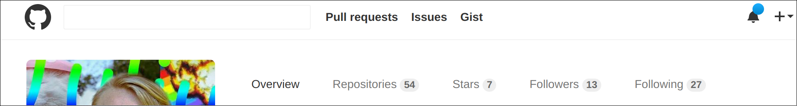

# Github Header plugin

I wasn't a big fan of the redesigned dark header for Github. So I figured I might as well roll a styling to fix the issue.

This is a chrome extension that adds a couple of classes to replace the styling of the header. This could likely be done even more easily without using JavaScript but I wasn't really feeling reading through google's docs when I wrote this.

## Installation

    Download the .crx file from this folder
    Navigate chrome to chrome://extensions
    Drop the crx file to the extension list

## Issues

- Since the styles are added with JavaScript, the header flashes dark before new styles are added.
  - Could be fixed by simply overriding the existing classes.

## License to provide some content to this readme

MIT License

Copyright (c) 2017 Julius Rajala

Permission is hereby granted, free of charge, to any person obtaining a copy
of this software and associated documentation files (the "Software"), to deal
in the Software without restriction, including without limitation the rights
to use, copy, modify, merge, publish, distribute, sublicense, and/or sell
copies of the Software, and to permit persons to whom the Software is
furnished to do so, subject to the following conditions:

The above copyright notice and this permission notice shall be included in all
copies or substantial portions of the Software.

THE SOFTWARE IS PROVIDED "AS IS", WITHOUT WARRANTY OF ANY KIND, EXPRESS OR
IMPLIED, INCLUDING BUT NOT LIMITED TO THE WARRANTIES OF MERCHANTABILITY,
FITNESS FOR A PARTICULAR PURPOSE AND NONINFRINGEMENT. IN NO EVENT SHALL THE
AUTHORS OR COPYRIGHT HOLDERS BE LIABLE FOR ANY CLAIM, DAMAGES OR OTHER
LIABILITY, WHETHER IN AN ACTION OF CONTRACT, TORT OR OTHERWISE, ARISING FROM,
OUT OF OR IN CONNECTION WITH THE SOFTWARE OR THE USE OR OTHER DEALINGS IN THE
SOFTWARE.